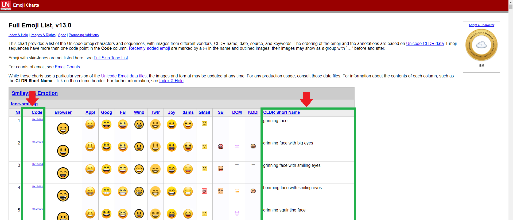

##  Instructions of adding emojis to resources

All emojis are listed in [this page](https://unicode.org/emoji/charts/full-emoji-list.html).
You should refer to the "Code" and "CLDR Short Name" columns of the list (see the following picture).

### Name and value rules

For each emoji's name, add prefix `emoji_`,
then add the name in the CLDR Short Name column in lowercase (replace each whitespace with `_` and remove `with` in the name).

For each emoji's value, refer to Code column, add `0's before to make the value become 8-digit.

Here is an example for the second emoji from the above picture:

Name: `emoji_grinning_face_big_eyes`

Value: `0001f603`

### Commit

In each of your commit, specify the number of emoji which you have reached.
In other words, if you have added emojis number 6 to 10 in a commit, include this in your commit message: `REACHED: 10`.

# IMPORTANT

It is planned to support emojis number 1 to 151 now since skin tone is still not supported.
If you have reached the 151st emoji, add other emojis that does not have different skin tones.
